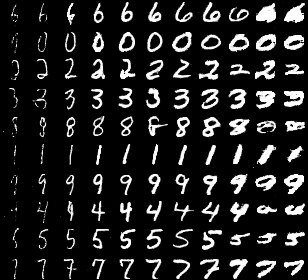
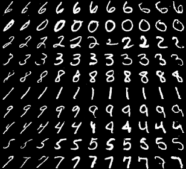

# InfoGAN-tensorflow
InfoGAN implementation in tensorflow based on the original   
[[paper]](https://arxiv.org/abs/1606.03657)

### Dependencies
Tensorflow(>=1.4)  
OpenCV  
NumPy  

### How to run?
For training:
```
sh train.sh
```

For testing:
```
sh test.sh
```

The results will be saved in `/path/to/model_dir/test`

### Results
Modify categorical latent code from 0 to 9(top to bottom) and  
continuous latent code(c1(width) or c2(rotation)) from -2 to 2(left to right)

<center>
<p>

<p>

